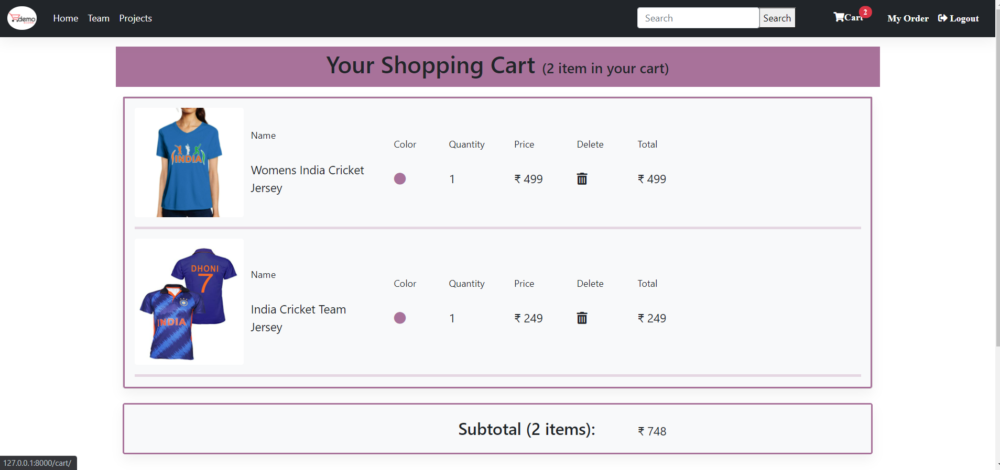

[](https://www.python.org/downloads/release/python-360/)


[](https://github.com/biswajit955/django-E-commerce/blob/main/LIENSE.txt)
# Django E-commerce
Django-ecommerce is an open-source ecommerce platform built on the Django Web Framework.
# Demo
## Homepage

## Cartpage

## Orderpage

## Features Included
- Search Functionality
- Shopping Cart
- Order Management
- Responsive, mobile-friendly design
- user authentication system
- user authentication system
- Much more...

## Installation

**1.clone Repository & Install Packages**
```sh
git clone https://github.com/biswajit955/django-E-commerce
pip install -r requirements.txt
```
**2.Setup Virtualenv**
```sh
virtualenv env
source env/bin/activate
```
**3.Migrate & Start Server**
```sh
python manage.py makemigrations
python manage.py migrate
python manage.py runserver
```

## Where to find Me
Like Me on [Facebook](https://www.facebook.com/biswajit.paloi.987/)
Or visit My [Website](https://github.com/biswajit955)
